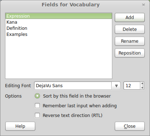
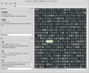
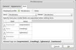
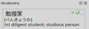

<!-- +++
Area = "projects"
GitHub = "yomichan-anki"
Layout = "page"
Tags = ["anki", "japanese", "pyqt", "python", "sql", "yomichan", "gpl license", "anki-connect"]
Description = "Plugin for sentence/vocab mining Japanese books in Anki."
Collection = "ProjectsComplete"
+++ -->

# Yomichan Anki

Yomichan is an Anki plugin built to help students of Japanese learn the language by reading native media on their
computer. This application's one-click flash card creation feature makes vocabulary mining trivial, allowing you to
focus on enjoying your reading.

*Note: This project is no longer maintained and has been superseded by the
[Yomichan](https://foosoft.net/projects/yomichan/) browser extension.*

## Installation

Yomichan can be downloaded from the [Anki shared addon page](https://ankiweb.net/shared/info/934748696). This plugin
will automatically notify you when updates are available.

## Usage

1.  Make sure you are running the latest version of Anki.
2.  Open your vocab deck and note the fields that are used in your deck.

    

3.  Launch Yomichan from the tools menu inside Anki.
4.  Open the text file you want and you will see its contents in the Yomichan.  Your layout and color scheme will look
    different because the screenshot shows my personal settings.

    

5.  To look up words hover your mouse over them while pressing the middle mouse button (usually this is your scroll
    wheel). You can also press and hold shift instead if you like (or your mouse has no center button).
6.  To set up your Anki deck for Yomichan select Preferences from the Edit menu and you should see a screen that looks
    like this:

    

7.  Now you should add markers such as `{expression}`, `{reading}`, `{reading}` and `{sentence}` to specify how new
    cards should be created. Card fields will vary depending on your deck model. If you want to be able to use
    *AnkiConnect* tick the checkbox labeled *Enable AnkiConnect* as shown above.

8.  When you look up definitions you will have the option to create Anki cards for them with one click. You will see the
    icons for performing these actions next to each item. *Icons for actions which update your decks won't show up if
    Anki thinks you can't add a fact with those items*. This likely means that they would either be duplicates of
    existing cards in the deck or that Yomichan hasn't been properly set up for your deck model.

    

    Here is what the icons mean (in order from left to right):
    *   Add term in Kana form even it can be written in Kanji (e.g. べんきょうか).
    *   Add term as it appears in the dictionary including Kanji (e.g. 勉強家).
    *   Copy the expression, reading and definition for the term to the clipboard.

### Keyboard Shortcuts

Yomichan features several keyboard shortcuts for ease of use:

| Shortcut                                          | Command                                             |
|---------------------------------------------------|-----------------------------------------------------|
| <kbd>Shift</kbd>                                  | Search under cursor                                 |
| <kbd>]</kbd>                                      | Move search cursor forwards                         |
| <kbd>[</kbd>                                      | Move search cursor backwards                        |
| <kbd>Shift</kbd> + <kbd>Ctrl</kbd> + <kbd>#</kbd> | Add current Kanji at index 0 - 9 to deck            |
| <kbd>Ctrl</kbd> + <kbd>#</kbd>                    | Add current term at index  0 - 9 to deck            |
| <kbd>Alt</kbd> + <kbd>#</kbd>                     | Add current term at index 0 - 9 to deck as Hiragana |

### Importing Vocabulary

Yomichan is capable of importing vocabulary lists from plain text files and the vocabulary deck database the Amazon
Kindle automatically generates when you look up words in the built-in dictionary (this file can be found as
`/system/vocabulary/vocab.db`). Note that importing does not create flash cards automatically, but rather outputs the
contents of the file to the Vocabulary and Kanji panes so that you can add facts the same way as when reading within
Yomichan.
