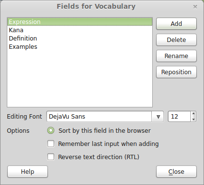
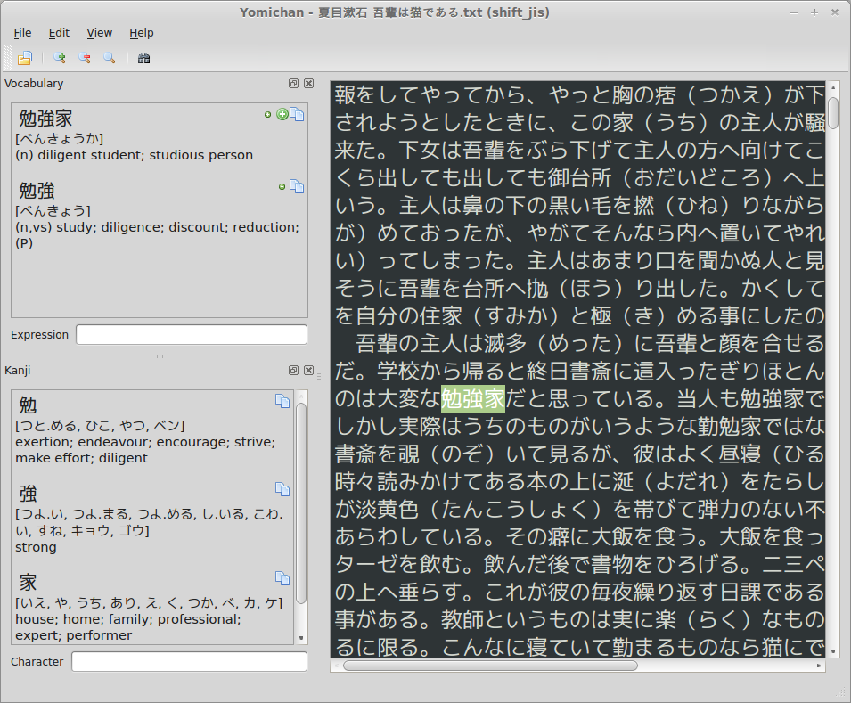
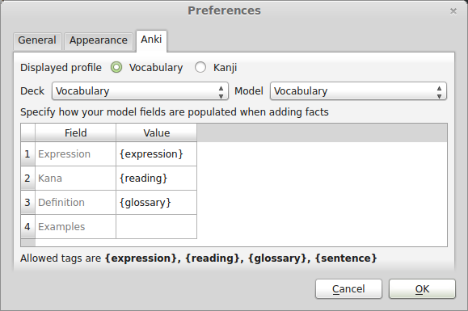
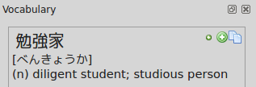

# Yomichan #

A while ago I started working on an [Anki](http://ankisrs.net/) plugin in an attempt to solve various annoyances I
encountered when trying to read Japanese books on my computer. Yomichan is the result of my efforts and makes Japanese
sentence/vocabulary mining trivial.

The software I was using for mining up to now was [Rikaichan](http://www.polarcloud.com/rikaichan/). I'm sure most
people studying the Japanese language are familiar with this browser extension and probably have it installed in
Firefox. Although pretty amazing, this tool is bound to Firefox.  Firefox is obviously not a book reader: it doesn't
behave well with large text files, doesn't remember where you last stopped reading, and most importantly there was no
integration with Anki. As such, adding new vocab to my Anki deck was annoying; I wanted to be able to do this with one
mouse click. After several hours of work, Yomichan could do this and much more.

Yomichan can be downloaded from the its [Anki shared addon page](https://ankiweb.net/shared/info/934748696) or the
[Yomichan page on GitHub](https://github.com/FooSoft/yomichan/). There is an automatic update checker included in the
plugin that (unless you disabled it in options) will notify you when new versions become available.

## Basic Usage Instructions ##

1.  Make sure you are running the latest version of Anki.
2.  Open your vocab deck and note the fields that are used in your deck.

    

3.  Launch Yomichan from the tools menu inside Anki.
4.  Open the text file you want and you will see its contents in the Yomichan.  Your layout and color scheme will look
    different because the screenshot shows my personal settings.

    

5.  To look up words hover your mouse over them while pressing the middle mouse button (usually this is your scroll
    wheel). You can also press and hold shift instead if you like (or your mouse has no center button).
6.  To set up your Anki deck for Yomichan select Preferences from the Edit menu and you should see a screen that looks
    like this:

    

7.  Now you should add markers such as `{expression}`, `{reading}`, `{reading}`, `{line}` and `{sentence}` to specify how new
    cards should be created. To get tab-separated fields of a line, use `{t0}`, `{t1}` and so on. Card fields will vary depending on your deck model.
8.  When you look up definitions you will have the option to create Anki cards for them with one click. You will see the
    icons for performing these actions next to each item. *Icons for actions which update your decks won't show up if
    Anki thinks you can't add a fact with those items*. This likely means that they would either be duplicates of
    existing cards in the deck or that Yomichan hasn't been properly set up for your deck model.

    

    Here is what the icons mean (in order from left to right):
    *   Add term in Kana form even it can be written in Kanji (e.g. べんきょうか).
    *   Add term as it appears in the dictionary including Kanji (e.g. 勉強家).
    *   Copy the expression, reading and definition for the term to the clipboard.

## Keyboard Shortcuts ##

By request, I've added several keyboard shortcuts which make Yomichan even easier to use:

| Shortcut               | Command                                             |
|------------------------|-----------------------------------------------------|
| `Shift`                | Search under cursor                                 |
| `]`                    | Move search cursor forwards                         |
| `[`                    | Move search cursor backwards                        |
| `Shift` + `Ctrl` + `#` | Add current Kanji at index 0 - 9 to deck            |
| `Ctrl` + `#`           | Add current term at index  0 - 9 to deck            |
| `Alt` + `#`            | Add current term at index 0 - 9 to deck as Hiragana |

## Importing Vocabulary ##

Yomichan is capable of importing vocabulary lists from plain text files and the vocabulary deck database the [Amazon
Kindle](http://en.wikipedia.org/wiki/Kindle) automatically generates when you look up words in the built-in dictionary
(this file can be found as `/system/vocabulary/vocab.db`). Note that importing does not create flash cards
automatically, but rather outputs the contents of the file to the Vocabulary and Kanji panes so that you can add facts
the same way as when reading within Yomichan.

## Learning Anki cards by reading ##

1.  It is recommended that your main learning decks have all the same note type. Make sure that the first card of the note type checks if you are able to recognize a Japanese word.
2.  Open a text file that contains a text that you want to learn
3.  To add a vocabulary to the vocabulary list of the text file, press shift while hovering over a word and click on the green button of the term that you want to add. If there is a blue button instead, click on this. This means that the vocabulary is already in a deck.
4.  Save the file anywhere.
5.  Re-open yomichan and open the file.
6.  Read the text and press shift on words that you forgot. This adds the vocabulary to the 'wrong' vocabulary list.
7.  After finishing the text, click on Learn Vocabulary. This reschedules the cards belonging to the vocabularies as follows: If the vocabulary is in the 'wrong' vocabulary list, answer the card as Bad. If not, answer it as Good.
    This might result in early reviews, where not due cards are answered. Yomichan handles these easily: The earlier the review, the smaller the change to that card. For example, if you answered today a card, and the same card happens to be in the vocabulary list, there is no change at all to that card. 
8.  Repeat 5.-7. as often as you want.  
